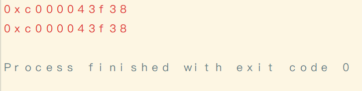

# go语言入门之数组与切片

## 数组

### 数组的声明

```
var name [SIZE] type
```

```go
var list [10] int
```

**注意**：

1. 数组长度必须是一个常量值
2. 数组长度是数组类型的一部分，也就是说下面a，b两个数组是不同类型的

```go
var a [10] int
var b [6] int

//不能这样做，a、b是不同类型的数组
a = b
```

### 数组初始化

#### 方式一  指定数组长度初始化

```go
var list1 = [5] int {1,2,3,4,5}
```

#### 方式二 推断长度初始化

```go
var list1 = [...] int {1,2,3,4,5}
//或者
list1 := [...] int {1,2,3,4,5}
```

### 多维数组的声明与初始化

#### 方式一

```go
var list = [2][2] int {
   {1,2},
   {1,2},
}
```

#### 方式二

```go
var list = [...][2] int {
   {1,2},
   {1,2},
}
```

**注意**

1. 多维数组**只有第一层**可以使用`...`来让编译器推导数组长度。

### 数组的访问

与其他语言一样，数组可以通过下标来访问，例如`array[index]`

### 数组的遍历

在go语言中，数组有两种遍历方式，具体请看下面的demo

```go
package main

import "fmt"

/**遍历数组
  @author 赖柄沣 bingfengdev@aliyun.com
  @date 2020-10-01 10:57:25
  @version 1.0
   */
func main() {
   var list =   [...] int{1,2,2,4,6}

// 遍历方式一
   for i:=0; i< len(list); i++{
      fmt.Print(list[i])
   }
fmt.Println()
// 遍历方式二
   for index := range list {
      fmt.Print(list[index])
   }


}
```
**输出**

```
12246
12246
```

### 数组是值类型

```go
package main

import "fmt"

/**数组是值类型证明
  @author 赖柄沣 bingfengdev@aliyun.com
  @date 2020-10-01 10:57:25
  @version 1.0
   */
func main() {
   var list =   [...] int{1,2,2,4,6}
   var list2 = list

   /**
   改变list2的值，如果数组是引用类型，那么list2和list指向同一个地址
   如果list2发生改变，则list也会发生改变
   否则，数组是值类型
   赋值语句会将数组值拷贝一份给副本，则改变副本的值对原数组不会产生影响
    */
   for index := range list2{
      list2[index] = 1

   }

   fmt.Print("原数组",list)
   fmt.Println()
   fmt.Print("副本",list2)

}
```

**输出**

```
原数组[1 2 2 4 6]
副本[1 1 1 1 1]
```

**注意：**

1. 数组支持 “==“、”!=” 操作符，因为内存总是被初始化过的。
2. `[n]*T`表示指针数组，`*[n]T`表示数组指针 。


## 切片类型

### 切片的定义

Go语言的切片（slice）切片是一个拥有相同类型元素的可变长度的序列，类似于Java的list。我们知道，数组的大小是一个确定值，因此，在某些需要动态地扩展容器大小的地方，数组将变得不太适用。而切片在数组的基础上做了一层封装，以便支持需要动态扩容的场景。

Go语言中切片的内部结构包含底层数组的地址、切片的大小和切片的容量三个部分。

### 切片的声明

#### 方式一

```go
// 声明一个int类型的切片
var i  [] int
```

#### 方式二 从数组中获取切片（初始化操作）

```go
package main

import "fmt"

/**由数组产生切片
  @author 赖柄沣 bingfengdev@aliyun.com
  @date 2020-10-01 23:18:21
  @version 1.0
   */
func main() {
	a := [...] int {1,2,3,4,5,6,7,8,9,0}
    //注意，这里的切片截取是[)即左包含，而右不包含的
	i := a[0:4]
	for index := range i{
		fmt.Print(i[index])
	}
	
}

```

**输出**

```
1234
```

#### 方式三 通过make构造切片

```go
// capacity代表切片容量，这是一个可选参数
slice = make([]T, length, capacity)
```

**注意**： 

1. 切片在未初始化之前是一个空切片(nil)
2. 要检查切片是否为空，请始终使用`len(s) == 0`来判断，而不应该使用`s == nil`来判断。
3. 切片之间不能直接比较。切片唯一合法的比较操作是和`nil`比较。 一个`nil`值的切片并没有底层数组，一个`nil`值的切片的长度和容量都是0。但是我们不能说一个长度和容量都是0的切片一定是`nil`

举个例子：

```go
package main

/**切片比较演示
  @author 赖柄沣 bingfengdev@aliyun.com
  @date 2020-10-02 09:27:38
  @version 1.0
   */
func main() {
   var a  [] int
    b := [] int{} //或者 b := make([]int, 0)
    println(a==nil)
    println(b==nil)

}
```

输出

```
true
false
```

### 切片表达式

上一小节当中的从数组获取切片，也是切片表达式的一种，下面介绍其他几种写法。

#### 省略开始位置

```go
//这个数组a下面的例子中继续沿用
a := [...] int {1,2,3,4,5,6,7,8,9,0}
i := a[:4]
```

#### 省略结束位置

```go
i := a[4:]
```

#### 开始、结束都省略

```go
i := a[:]
```

**提示：** 切片表达式也可以用来操作切片，即上面的数组a也可以是一个切片。

### len() 和 cap() 函数

切片是可索引的，并且可以由 len() 方法获取长度。

切片提供了计算容量的方法 cap() 可以测量切片最长可以达到多少。

请看下方的demo

```go
package main

/**len()和cap()函数演示
  @author 赖柄沣 bingfengdev@aliyun.com
  @date 2020-10-01 23:18:21
  @version 1.0
   */
func main() {
   a := [...] int {1,2,3,4,5,6,7,8,9,0}
   i := a[2:6]

   //获取切片长度并打印
   println(len(i))

   //获取切片容量并打印
   println(cap(i))

}
```

输出

```
4
8
```

看到这里，大家或许会对切片容量和长度这两个值感到疑惑。上文咱讲切片的定义时曾说到，切片是对数组的封装，内部结构包含底层数组的地址、切片的大小和切片的容量三个部分。

切片的长度等于切片结束下标值减去切片开始下标值：

length = endIndex-startIndex

切片容量capacity等于底层数组长度减去开始下标值

capacity = len(array) - startIndex

所以上面的例子中的切片长度和容量分别是4和8。而底层数组的地址指向的就是切片开始下标对应值所在的内存地址。

```go
/**切片地层数组地址演示
  @author 赖柄沣 bingfengdev@aliyun.com
  @date 2020-10-02 09:27:38
  @version 1.0
   */
func main() {
   a := [...] int {1,2,3,4,5,6,7,8,9,0}
   i := a[2:6]

   println(&i[0])
   println(&a[2])

}
```
**输出**



这也再一次证明了切片是引用类型。

### 切片的直接赋值和copy()函数

#### 直接赋值

```go
package main

/**切片的赋值
  @author 赖柄沣 bingfengdev@aliyun.com
  @date 2020-10-02 09:27:38
  @version 1.0
   */
func main() {
   a := [...] int {1,2,3,4,5,6,7,8,9,0}
   i := a[2:6]
   //将i直接赋值给j，i、j将共用一个底层数组a
   j := i
   println(&i)
   println(&j)

}
```

**注意**

1. 对切片i的操作将影响到切片j

**举个例子**

```go
package main

/**切片的赋值
  @author 赖柄沣 bingfengdev@aliyun.com
  @date 2020-10-02 09:27:38
  @version 1.0
   */
func main() {
   a := [...] int {1,2,3,4,5,6,7,8,9,0}
   i := a[2:6]
   //将i直接赋值给j，i、j将共用一个底层数组a
   j := i

   i[0] = 6
   println(j[0])
   println(a[2])

}
```

输出

```
6
6
```

这不难理解，因为i、j都是一个保持对数组a的引用，因此，改变i的值实际上改变的是数组a的值，所以j也会受到影响。

#### copy()函数

```go
package main

/**copy（）函数的使用
  @author 赖柄沣 bingfengdev@aliyun.com
  @date 2020-10-02 09:27:38
  @version 1.0
   */
func main() {
   a := [...] int {1,2,3,4,5,6,7,8,9,0}
   i := a[2:6]
   j := make([]int,len(i),cap(i))
   copy(j,i)
   i[0] = 6
   println(j[0])
   println(a[2])
}
```

输出

```
3
6
```

显然，这里的i、j所对应的底层数组不是同一个。

### append()函数的使用

#### 为切片添加新元素

Go语言的内建函数`append()`可以为切片动态添加元素。 可以一次添加一个元素，可以添加多个元素，也可以添加另一个切片中的元素（切片参数后面加…）

```go
package main

import (
	"fmt"
)

/**append()函数的使用
  @author 赖柄沣 bingfengdev@aliyun.com
  @date 2020-10-02 09:59:36
  @version 1.0
   */
func main() {
	//声明一个int类型的切片
	var a [] int
	b := [] int{5,6,7}
	//向切片a中追加元素
	a = append(a, 1,2,4)
	//将切片a的元素追加切片b
	b  = append(b,a...)
	
	fmt.Println(a)
	fmt.Println(b)

}

```

输出

```
[1 2 4]
[5 6 7 1 2 4]
```

#### 移除元素

在go语言当中，目前并没有为切片移除元素的函数，因此我们使用append()来做移除操作。

```go
package main

import "fmt"

/**切片移除元素
  @author 赖柄沣 bingfengdev@aliyun.com
  @date 2020-10-02 10:23:51
  @version 1.0
   */
func main() {
   a := [] int{5,6,7}

   //删除索引为1的元素
   a = append(a[:1],a[2:]...)

   fmt.Println(a)
}
```

输出

```
[5 7]
```

**提示** 

每个切片会指向一个底层数组，这个数组的容量够用就添加新增元素。当底层数组不能容纳新增的元素时，切片就会自动按照一定的策略进行“扩容”，此时该切片指向的底层数组就会更换。“扩容”操作往往发生在`append()`函数调用时，所以我们通常都需要用原变量接收append函数的返回值。

### 切片的排序

#### 对int类型的元素排序

```go
package main

import (
   "fmt"
   "sort"
)

/**切片排序
  @author 赖柄沣 bingfengdev@aliyun.com
  @date 2020-10-02 10:23:51
  @version 1.0
   */
func main() {
   a := [] int{9,6,7}

   //对int类型的元素进行排序
   sort.Ints(a)

   fmt.Println(a)
}
```

输出

```
[6 7 9]
```

#### 对string类型的元素排序

```go
package main

import (
   "fmt"
   "sort"
)

/**切片排序
  @author 赖柄沣 bingfengdev@aliyun.com
  @date 2020-10-02 10:23:51
  @version 1.0
   */
func main() {
   s := [] string {"zhangsan","wangwu","lisi","zhaoliu","suiqi","songjiu"}
   sort.Strings(s)
   fmt.Println(s)
}
```

输出

```
[lisi songjiu suiqi wangwu zhangsan zhaoliu]
```

### 查找元素位置

```go
package main

import (
	"fmt"
	"sort"
)

/**切片查找元素位置
  @author 赖柄沣 bingfengdev@aliyun.com
  @date 2020-10-02 10:23:51
  @version 1.0
   */
func main() {
	s := [] string {"张三","王五","李四","赵六","孙七","宋九"}
	sort.Strings(s)
	fmt.Println(s)
	a := sort.SearchStrings(s,"李四")
	fmt.Println(s[a])
	fmt.Println(a)
}

```

输出

```
[张三 王五 李四 赵六 孙七 宋九]
王五
1
```

**注意**

1. 查找之前需要先对切片进行排序

### 切片的扩容策略

以下源码摘自`/src/runtime/slice.go`

```
func growslice(et *_type, old slice, cap int) slice {
   //省略了不影响理解的部分代码

   newcap := old.cap
   doublecap := newcap + newcap
   if cap > doublecap {
      newcap = cap
   } else {
      if old.len < 1024 {
         newcap = doublecap
      } else {
         // Check 0 < newcap to detect overflow
         // and prevent an infinite loop.
         for 0 < newcap && newcap < cap {
            newcap += newcap / 4
         }
         // Set newcap to the requested cap when
         // the newcap calculation overflowed.
         if newcap <= 0 {
            newcap = cap
         }
      }
   }

  //省略了不影响理解的部分代码
}
```

分析：

1. 首先判断，如果新申请容量（cap）大于2倍的旧容量（old.cap），最终容量（newcap）就是新申请的容量（cap）；
2. 否则，如果旧切片的长度小于1024，则最终容量(newcap)就是旧容量(old.cap)的两倍，即（newcap=doublecap）；
3. 否则，如果旧切片长度大于等于1024，则最终容量（newcap）从旧容量（old.cap）开始循环增加原来的1/4，即（newcap=old.cap,for {newcap += newcap/4}）直到最终容量（newcap）大于等于新申请的容量(cap)，即（newcap >= cap）；
4. 如果最终容量（cap）计算值溢出，则最终容量（cap）就是新申请容量（cap）。

注意：

切片扩容还会根据切片中元素的类型不同而做不同的处理，比如`int`和`string`类型的处理方式就不一样。


